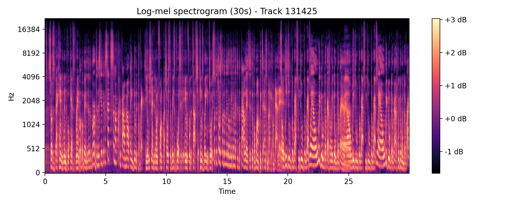
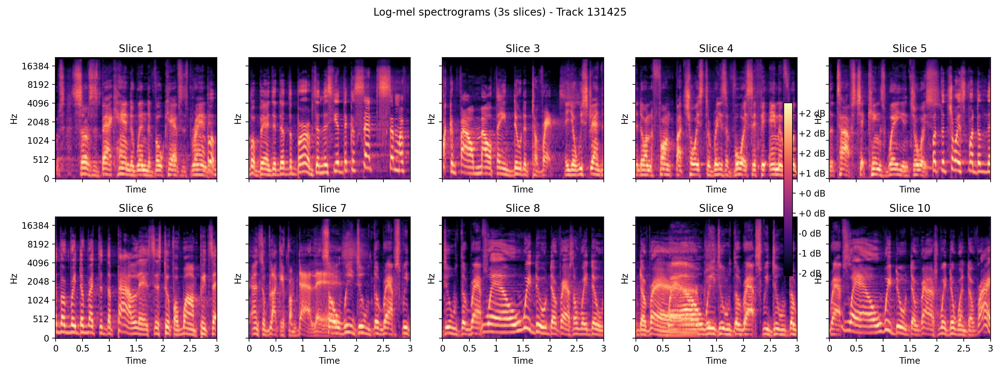
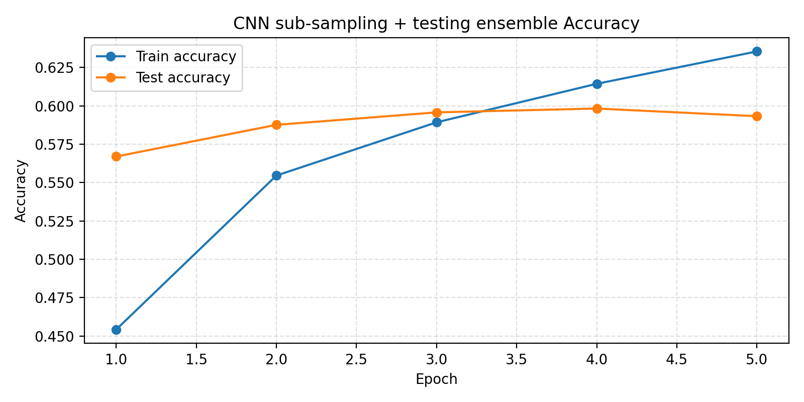
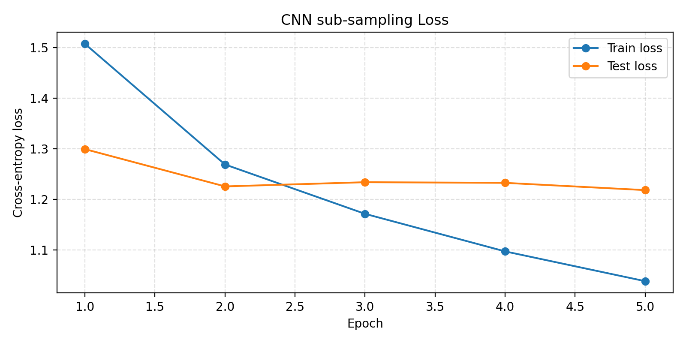
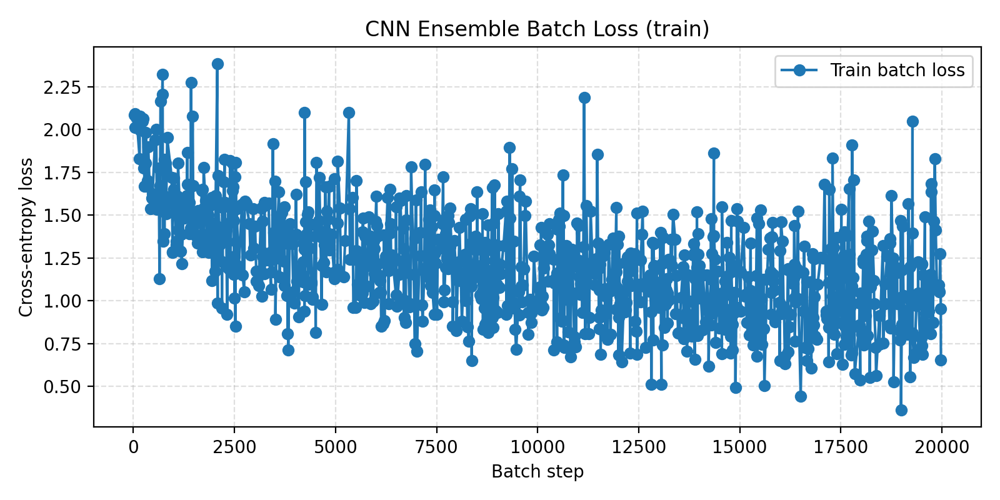

# DL Project

Deep learning experiments for audio classification using the FMA dataset ([1]).

Author: Colin MININI.

# Instructions to run

## Initialization
- Create a new python environment `.venv` and install `requirements.txt`
- Download FMA Small audio: https://os.unil.cloud.switch.ch/fma/fma_small.zip
- Download FMA metadata: https://os.unil.cloud.switch.ch/fma/fma_metadata.zip
- Unzip both into the repository `data/` folder so that the internal folders of each .zip end up at `data/fma_small/` and `data/fma_metadata/` (keep the internal directory structure from the zips).
- Compute and cache log-mel spectrograms of both 30- and 3-second audio clips by running: `python scripts/utils/mels.py` (writes `.npy` files into `data/mels/`)

## Running
- To re-train, run `notebook.ipynb`.
- Training logs are saved in `/runs/logs/`. To visualize them (also works live) run: tensorboard --logdir runs/CNN_exp
- Model checkpoints are saved in `/runs/checkpoints/`

# Project

## Objective
The objective of this project is to do genre classification on 30-second music audio clips. The dataset used here is the FMA Dataset ([1]) (Github link: https://github.com/mdeff/fma). More specifically we work on the fma-small dataset, which contains 8k audio samples for 8 equally distributed main genres (Hip-Hop, Electro, Experimental...); the full pipeline is detailed in [3].
- fma-small (download here: https://os.unil.cloud.switch.ch/fma/fma_small.zip) is a folder containing the .mp3 samples.
- fma_metadata (download here: https://os.unil.cloud.switch.ch/fma/fma_metadata.zip) is a folder containing different metadata .csv files about the dataset. In particular it includes the `genres.csv` metadata file that helps us create `data/labeled_tracks.csv` (run `python scripts/utils/labaled_tracks.py`), with features: track_id, audio_filepath, genre_class.

## Dataset
- I found 3 audio samples in the dataset to be corrupted (they could not be loaded). I removed these 3 files from the working dataset and removed 7 other files randomly to make the ensemble learning experiment easier. The number of working samples is now 7990.
- I worked both on the full 30-second audio clips and on 3-second sub-samples. The idea is that the mel-spectrograms of 3-second sub-samples have a shape closer to traditional image formats—roughly squared 2D tensors—and would then be better processed by classical computer vision deep learning architectures, namely a Convolutional Neural Network ([2]). An improvement from that training setting is that we can do ensemble testing. For testing, instead of doing classification on the 30-second audio samples, we split the sample we want to predict into ten 3-second clips. Then we predict the genre of every one of these ten clips and average predictions (average logits). The model has been trained on both settings for comparison (30/3 seconds inputs).

## Preprocessing
- Audios from the FMA dataset do not all have an exact 30-second length, so I padded/truncated every sample to make sure all have the same shape. The idea is not to work on the audio waveform of input samples itself (variation of air pressure over time) (see figure [Waveform]), which is uninterpretable by humans, but rather on their mel-spectrogram. More specifically we work on log-dB mel-spectrograms that are closer to human interpretability of sounds: humans do not hear the high frequencies as well as the lower ones, and the logarithmic scale takes this into account in its 2D representation of the audio. Mel-spectrograms are a 2D representation of an audio clip showing each frequency’s energy over time. To compute the log-mel spectrogram of an audio clip we compute a short-time Fourier transform with n_fft=2048 and hop_length=512. For each of these FFT windows we evaluate the energy of the frequencies and project them into 128 mel bins corresponding to a logarithmic scale on the frequency axis. That makes a 2D tensor representing the audio clip (see figures [30s mel] and [3s grid]).

## Model architecture
The model I used for training has a classical CNN architecture ([2]) (see `scripts/models.py` for layer shapes):
- 4 sequential convolutional layers that each are composed of: 2D convolution layer / ReLU / Maxpool 2D / Dropout layer
- A two-layer ReLU perceptron for classification

## Ensemble testing
- The dataset split is a classical 80/20 train/test split. I trained my model on both different settings for comparison purposes: 30-second audio clips / 3-second audio clips + ensemble testing on the 30-second testing audios. The ensemble meta-dataset used for training contains the 30-second audio decomposition. The 30-second clips are shuffled but the sub-samples of each full clip are ordered in the dataset (see `data/metadata_ensemble.csv`). I made sure the testing dataframe of 3-second subsamples started with the beginning of a 30-second audio by setting the size of the original dataset to 7990 and not 7997 and I made sure the subsamples for each full audio sample are ordered (in `scripts/utils/data_loading.py` test_df: shuffle=False).
- To take ensemble testing into account I adapted the testing function in my trainer (see `scripts/trainer.py` test function): 
I iterate testing batches over the test_loader as usual but in the test function I defined memory buffers of size 10. When the buffers are filled—meaning that they have received 10 sets of logits and 10 ground truth labels—they are used for prediction of a single 30-second audio sample. Each of the 10 predictions have the same weight so I average predictions by averaging the ten logits; that way I keep the confidence of each prediction into account when computing the final prediction compared to a maximum-frequency-of-predicted-labels technique.

## Training
- Training on both datasets was done locally on a MacBook Pro 14 CPU with 16 GB of memory. Training time was about 10 minutes per epoch for the 30-second (8K samples) dataset and 8 minutes per epoch for the sub-sampled dataset (80k samples).
- The model trained on the 3s ensemble setting converges in 5 epochs (see `notebook.ipynb` or run: `tensorboard --logdir runs/logs/CNN_exp_ensemble`). The fma-small dataset has been augmented for training, meaning for each epoch the model is trained on a huge amount of samples - roughly 64k samples - thus the quick convergence. Training was done on a cross-entropy criterion and with the Adam optimizer, with no learning rate scheduler or gradient clipping.

## Results (see `notebook.ipynb` or run: `tensorboard --logdir runs/logs`)
- For the sub-sampled dataset, after training we obtain a testing accuracy of 60%. It is significantly above the 12.5% accuracy for random predictions so we can safely assume the model has learned from training.
- For the 30-second dataset, the model did not learn. This demonstrates the sub-sampling relevance for this task.
- The sub-sampling + ensemble testing technique has led to more prediction accuracy and robustness!

 
 

# References
- FMA paper ([1]) — `sources/FMA- A DATASET FOR MUSIC ANALYSIS.pdf`
- CNN paper ([2]) — `sources/Convolutional Neural Networks.pdf`
